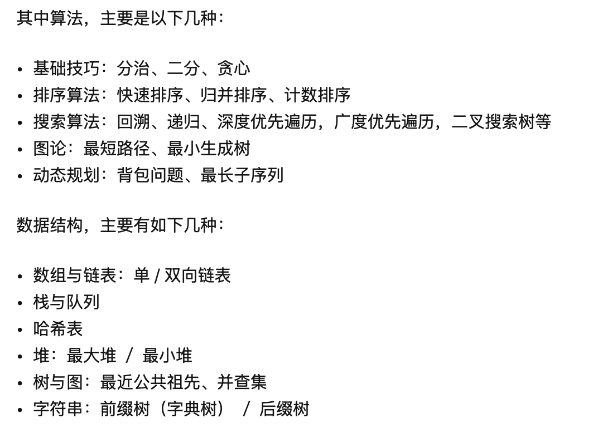

<!-- TOC -->

- [Pattern: Sliding window，滑动窗口类型](#pattern-sliding-window%E6%BB%91%E5%8A%A8%E7%AA%97%E5%8F%A3%E7%B1%BB%E5%9E%8B)
- [Pattern: two points, 双指针类型](#pattern-two-points-%E5%8F%8C%E6%8C%87%E9%92%88%E7%B1%BB%E5%9E%8B)
- [Pattern: Fast & Slow pointers, 快慢指针类型](#pattern-fast--slow-pointers-%E5%BF%AB%E6%85%A2%E6%8C%87%E9%92%88%E7%B1%BB%E5%9E%8B)
- [Pattern: Merge Intervals，区间合并类型](#pattern-merge-intervals%E5%8C%BA%E9%97%B4%E5%90%88%E5%B9%B6%E7%B1%BB%E5%9E%8B)
- [Pattern: Cyclic Sort，循环排序](#pattern-cyclic-sort%E5%BE%AA%E7%8E%AF%E6%8E%92%E5%BA%8F)
- [Pattern: In-place Reversal of a LinkedList，链表翻转](#pattern-in-place-reversal-of-a-linkedlist%E9%93%BE%E8%A1%A8%E7%BF%BB%E8%BD%AC)
- [Pattern: Tree Breadth First Search，树上的BFS](#pattern-tree-breadth-first-search%E6%A0%91%E4%B8%8A%E7%9A%84bfs)
- [Pattern: Tree Depth First Search，树上的DFS](#pattern-tree-depth-first-search%E6%A0%91%E4%B8%8A%E7%9A%84dfs)
- [Pattern: Two Heaps，双堆类型](#pattern-two-heaps%E5%8F%8C%E5%A0%86%E7%B1%BB%E5%9E%8B)
- [Pattern: Subsets，子集类型，一般都是使用多重DFS](#pattern-subsets%E5%AD%90%E9%9B%86%E7%B1%BB%E5%9E%8B%E4%B8%80%E8%88%AC%E9%83%BD%E6%98%AF%E4%BD%BF%E7%94%A8%E5%A4%9A%E9%87%8Ddfs)
- [Pattern: Modified Binary Search，改造过的二分](#pattern-modified-binary-search%E6%94%B9%E9%80%A0%E8%BF%87%E7%9A%84%E4%BA%8C%E5%88%86)
- [Pattern: Top ‘K’ Elements，前K个系列](#pattern-top-k-elements%E5%89%8Dk%E4%B8%AA%E7%B3%BB%E5%88%97)
- [Pattern: K-way merge，多路归并](#pattern-k-way-merge%E5%A4%9A%E8%B7%AF%E5%BD%92%E5%B9%B6)
- [Pattern: 0/1 Knapsack Dynamic Programming，0/1背包类型](#pattern-01-knapsack-dynamic-programming01%E8%83%8C%E5%8C%85%E7%B1%BB%E5%9E%8B)
- [Pattern: Topological Sort Graph，拓扑排序类型](#pattern-topological-sort-graph%E6%8B%93%E6%89%91%E6%8E%92%E5%BA%8F%E7%B1%BB%E5%9E%8B)
- [Pattern: heap，堆](#pattern-heap%E5%A0%86)
- [二分查找](#%E4%BA%8C%E5%88%86%E6%9F%A5%E6%89%BE)
- [分治算法](#%E5%88%86%E6%B2%BB%E7%AE%97%E6%B3%95)
- [动态规划](#%E5%8A%A8%E6%80%81%E8%A7%84%E5%88%92)
- [贪心算法](#%E8%B4%AA%E5%BF%83%E7%AE%97%E6%B3%95)
- [hash方法](#hash%E6%96%B9%E6%B3%95)
- [回溯方法](#%E5%9B%9E%E6%BA%AF%E6%96%B9%E6%B3%95)

<!-- /TOC -->

[刷leetcode需要哪些基础](https://www.zhihu.com/question/30737325/answer/524120016)

# 1. Pattern: Sliding window，滑动窗口类型

    LeetCode-cn经典题目：
    3题无重复字符的最长子串
    76题最小覆盖子串
    239题滑动窗口最大值
    480题滑动窗口中位数
    424题替换后的最长重复字符
    567题字符串的排列

    www.educative.io题目
    Maximum Sum Subarray of Size K (easy)
    Smallest Subarray with a given sum (easy)
    Longest Substring with K Distinct Characters (medium)
    Fruits into Baskets (medium)
    No-repeat Substring (hard)
    Longest Substring with Same Letters after Replacement (hard)
    Longest Subarray with Ones after Replacement (hard)

# 2. Pattern: two points, 双指针类型

LeetCode-cn经典题目：
11题盛水最多的容器
27题移除元素
16题最接近的三数之和
15题三数之和

www.educative.io题目
Pair with Target Sum (easy)
Remove Duplicates (easy)
Squaring a Sorted Array (easy)
Triplet Sum to Zero (medium)
Triplet Sum Close to Target (medium)
Triplets with Smaller Sum (medium)
Subarrays with Product Less than a Target (medium)
Dutch National Flag Problem (medium)

# 3. Pattern: Fast & Slow pointers, 快慢指针类型

    LeetCode-cn经典题目：
    19题删除链表倒数第N个节点
    141题环形链表
    142题环形链表II

    www.educative.io题目
    LinkedList Cycle (easy)
    Start of LinkedList Cycle (medium)
    Happy Number (medium)
    Middle of the LinkedList (easy)

# 4. Pattern: Merge Intervals，区间合并类型

    LeetCode-cn经典题目：
    56题区间合并
    57题插入区间

    Merge Intervals (medium)
    Insert Interval (medium)
    Intervals Intersection (medium)
    Conflicting Appointments (medium)

# 5. Pattern: Cyclic Sort，循环排序

    经典题目：
    Cyclic Sort (easy)
    Find the Missing Number (easy)
    Find all Missing Numbers (easy)
    Find the Duplicate Number (easy)
    Find all Duplicate Numbers (easy)

# 6. Pattern: In-place Reversal of a LinkedList，链表翻转

    LeetCode-cn经典题目：
    206反转链表
    92题反转链表II
    25题K个一组翻转链表

    经典题目：
    Reverse a LinkedList (easy)
    Reverse a Sub-list (medium)
    Reverse every K-element Sub-list (medium)

# 7. Pattern: Tree Breadth First Search，树上的BFS

    LeetCode-cn经典题目：
    102题二叉树的层次遍历
    107题二叉树的层次遍历II
    103题二叉树的锯齿形层次遍历
    637题二叉树的层平均值
    111题二叉树的最小深度
    993题二叉树的堂兄弟节点

    Binary Tree Level Order Traversal (easy)
    Reverse Level Order Traversal (easy)
    Zigzag Traversal (medium)
    Level Averages in a Binary Tree (easy)
    Minimum Depth of a Binary Tree (easy)
    Level Order Successor (easy)
    Connect Level Order Siblings (medium)

# 8. Pattern: Tree Depth First Search，树上的DFS

    经典题目：
    Binary Tree Path Sum (easy)
    112题路径总和
    All Paths for a Sum (medium)
    113题路径总和II
    Sum of Path Numbers (medium)
    Path With Given Sequence (medium)
    Count Paths for a Sum (medium)

# 9. Pattern: Two Heaps，双堆类型

    经典题目：
    Find the Median of a Number Stream (medium)
    295题数据流的中位数
    Sliding Window Median (hard)
    480题滑动窗口中位数
    Maximize Capital (hard)
    502题IPO

# 10. Pattern: Subsets，子集类型，一般都是使用多重DFS

    经典题目：
    Subsets (easy)
    Subsets With Duplicates (easy)
    Permutations (medium)
    String Permutations by changing case (medium)
    Balanced Parentheses (hard)
    Unique Generalized Abbreviations (hard)

# 11. Pattern: Modified Binary Search，改造过的二分

    经典题目：
    Order-agnostic Binary Search (easy)
    Ceiling of a Number (medium)
    Next Letter (medium)
    Number Range (medium)
    Search in a Sorted Infinite Array (medium)
    Minimum Difference Element (medium)
    Bitonic Array Maximum (easy)

# 12. Pattern: Top ‘K’ Elements，前K个系列

    经典题目：
    Top ‘K’ Numbers (easy)
    Kth Smallest Number (easy)
    ‘K’ Closest Points to the Origin (easy)
    Connect Ropes (easy)
    Top ‘K’ Frequent Numbers (medium)
    Frequency Sort (medium)
    Kth Largest Number in a Stream (medium)
    ‘K’ Closest Numbers (medium)
    Maximum Distinct Elements (medium)
    Sum of Elements (medium)
    Rearrange String (hard)

# 13. Pattern: K-way merge，多路归并

    LeetCode-cn经典题目：
    23题合并k个排序链表
    378题有序矩阵中第k小的元素

    经典题目：
    Merge K Sorted Lists (medium)
    Kth Smallest Number in M Sorted Lists (Medium)
    Kth Smallest Number in a Sorted Matrix (Hard)
    Smallest Number Range (Hard)

# 14. Pattern: 0/1 Knapsack (Dynamic Programming)，0/1背包类型

    经典题目：
    0/1 Knapsack (medium)
    Equal Subset Sum Partition (medium)
    Subset Sum (medium)
    Minimum Subset Sum Difference (hard)

# 15. Pattern: Topological Sort (Graph)，拓扑排序类型

    经典题目：
    Topological Sort (medium)
    Tasks Scheduling (medium)
    Tasks Scheduling Order (medium)
    All Tasks Scheduling Orders (hard)
    Alien Dictionary (hard)

# 16. Pattern: heap，堆

    LeetCode-cn经典题目：
    23题合并K个排序链表
    215题数组中的第K个最大元素

# 二分查找

    69题x的平方根
    33题搜索旋转排序数组
    34题在排序数组中查找元素的第一个和最后一个位置

# 分治算法

# 动态规划

# 贪心算法

# hash方法

# 回溯方法
