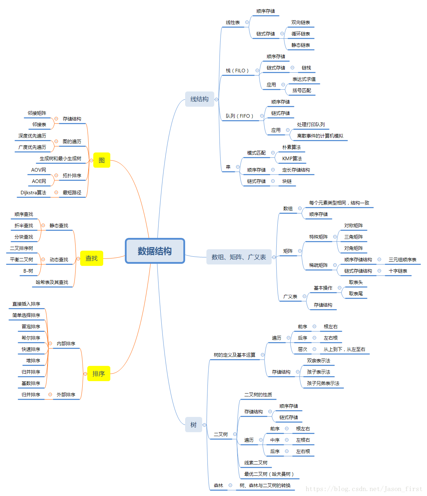
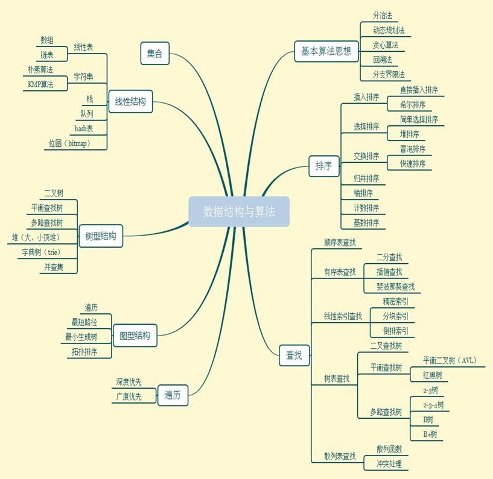

数据结构部分：
数组 array
链表 linked list
    创建dummy node的技巧可以简化代码
    单向链表，双向链表
栈 stack
    栈用单向链表实现（比数组实现更好），每次新加节点为头结点
队列 queue
    队列用双向链表实现（比数组实现更好）
    只允许在队尾查看和添加数据，在队头查看和删除数据
双端队列 deque
    双端队列和普通队列最大的不同在于，它允许我们在队列的头尾两端都能在 O(1) 的时间内进行数据的查看、添加和删除。

二叉树 binary tree

优先队列 priority queue
    优先队列的本质是一个二叉堆结构。堆在英文里叫 Binary Heap，它是利用一个数组结构来实现的完全二叉树。换句话说，优先队列的本质是一个数组，数组里的每个元素既有可能是其他元素的父节点，也有可能是其他元素的子节点，而且，每个父节点只能有两个子节点，很像一棵二叉树的结构。

哈希表 hash table

堆 heap
并查集 union find
字典树 trie

线段树和树状数组

[递归的理解1](https://www.zhihu.com/question/31412436/answer/683820765)
[递归的理解2](https://mp.weixin.qq.com/s/me_khSJYluLfTxwKEMMrPQ)
[分治、动态规划、回溯、贪心 各自特点以及联系总结](https://zhuanlan.zhihu.com/p/148157101)

