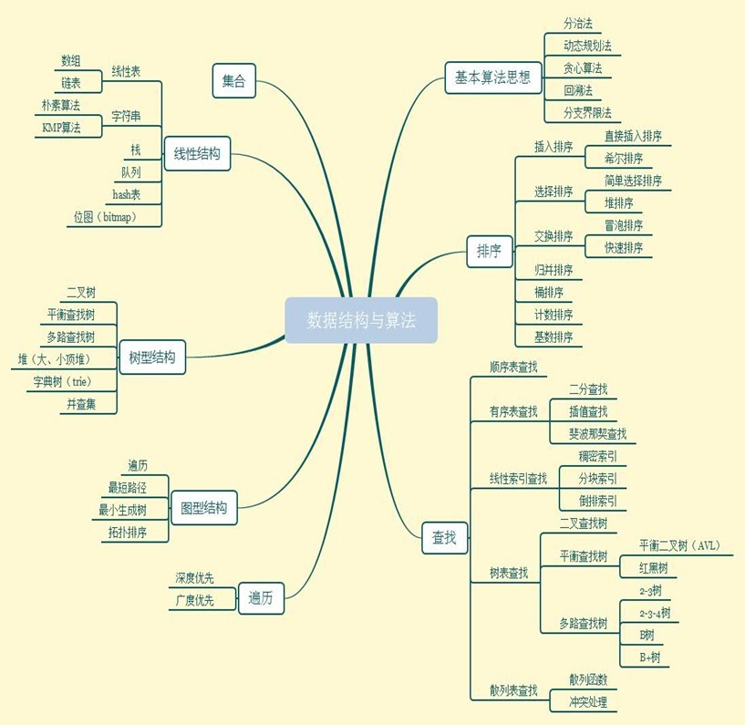

<!-- TOC -->

- [递归方法](#%E9%80%92%E5%BD%92%E6%96%B9%E6%B3%95)
    - [递归的两个特点](#%E9%80%92%E5%BD%92%E7%9A%84%E4%B8%A4%E4%B8%AA%E7%89%B9%E7%82%B9)
    - [递归写法的基本套路（四步骤）：](#%E9%80%92%E5%BD%92%E5%86%99%E6%B3%95%E7%9A%84%E5%9F%BA%E6%9C%AC%E5%A5%97%E8%B7%AF%E5%9B%9B%E6%AD%A5%E9%AA%A4)
- [分治法](#%E5%88%86%E6%B2%BB%E6%B3%95)
    - [分治的四个特点](#%E5%88%86%E6%B2%BB%E7%9A%84%E5%9B%9B%E4%B8%AA%E7%89%B9%E7%82%B9)
    - [分治写法的基本套路（三步骤）](#%E5%88%86%E6%B2%BB%E5%86%99%E6%B3%95%E7%9A%84%E5%9F%BA%E6%9C%AC%E5%A5%97%E8%B7%AF%E4%B8%89%E6%AD%A5%E9%AA%A4)
- [动态规划法](#%E5%8A%A8%E6%80%81%E8%A7%84%E5%88%92%E6%B3%95)
    - [动态规划的特点](#%E5%8A%A8%E6%80%81%E8%A7%84%E5%88%92%E7%9A%84%E7%89%B9%E7%82%B9)
- [贪心算法](#%E8%B4%AA%E5%BF%83%E7%AE%97%E6%B3%95)
- [回溯法 （DFS搜索解空间）](#%E5%9B%9E%E6%BA%AF%E6%B3%95-dfs%E6%90%9C%E7%B4%A2%E8%A7%A3%E7%A9%BA%E9%97%B4)
- [分支界限法（BFS搜索解空间）todo](#%E5%88%86%E6%94%AF%E7%95%8C%E9%99%90%E6%B3%95bfs%E6%90%9C%E7%B4%A2%E8%A7%A3%E7%A9%BA%E9%97%B4todo)

<!-- /TOC -->



# 递归方法

递归是算法设计与分析中经常使用的一种技术，描写叙述简单且易于理解，但递归的效率往往比较低下。https://mp.weixin.qq.com/s/me_khSJYluLfTxwKEMMrPQ

## 递归的两个特点

```
1、一个问题可以分解成具有相同解决思路的子问题，子子问题。
2、经过层层分解的子问题最后一定是有一个不能再分解的固定值的（即终止条件）。
```

## 递归写法的基本套路（四步骤）：

可以参考一些例子，体会四步骤。

```
1、先定义一个函数，明确这个函数的功能，由于递归的特点是问题和子问题都会调用函数自身，所以这个函数的功能一旦确定了，之后只要找寻问题与子问题的递归关系即可。

2、寻找问题与子问题间的关系（即递推公式），这样由于问题与子问题具有相同解决思路，只要子问题调用步骤1定义好的函数，问题即可解决。所谓的关系最好能用一个公式表示出来，比如 f(n) = n * f(n-1) 这样，如果暂时无法得出明确的公式，用伪代码表示也是可以的，发现递推关系后，要寻找临界条件，确保子问题不会无限分解下去。由于第一步我们已经定义了这个函数的功能，所以当问题拆分成子问题时，子问题可以调用步骤 1 定义的函数，符合递归的条件（函数里调用自身）。

3、将第二步的递推公式用代码表示出来补充到步骤 1 定义的函数中。

4、最后也是很关键的一步，根据问题与子问题的关系，推导出时间复杂度，如果发现递归时间复杂度不可接受，则需转换思路对其进行改造，看下是否有更靠谱的解法。
```

```python
// 第一步定义函数
public int factorial(int n) {
    // 第二步的临界条件
    if (n <= 1) {
        return 1;
    }
    // 第二步的递推公式
    return n * factorial(n-1)
}
```

典型样例：Fibonacci数列，阶乘，Hanoi塔。

递归例子：？？？？？？

# 分治法

分治法的设计思想是将一个规模为n难以解决的问题分解为k个规模较小的子问题，这些子问题**相互独立且与原问题同样**。


具体做法，求解大问题时，需要递归的求小问题，因此一般用「递归」的方法实现，即自顶向下。递归地解这些子问题，然后将各子问题的解合并得到原问题的解。

## 分治的四个特点

```
分治法所能解决的问题一般具有以下几个特征：

1、该问题的规模缩小到一定的程度就可以容易地解决。
第一条特征是绝大多数问题都可以满足的，因为问题的计算复杂性一般是随着问题规模的增加而增加；

2) 该问题可以分解为若干个规模较小的相同问题，即该问题具有最优子结构性质。
第二条特征是应用分治法的前提它也是大多数问题可以满足的，此特征反映了递归思想的应用；

3) 利用该问题分解出的子问题的解可以合并为该问题的解；
第三条特征是关键，能否利用分治法完全取决于问题是否具有第三条特征，如果具备了第一条和第二条特征，而不具备第三条特征，则可以考虑用贪心法或动态规划法。

4) 该问题所分解出的各个子问题是相互独立的，即子问题之间不包含公共的子子问题。
第四条特征涉及到分治法的效率，如果各子问题是不独立的则分治法要做许多不必要的工作，重复地解公共的子问题，此时虽然可用分治法，但一般用动态规划法较好。
```

## 分治写法的基本套路（三步骤）

```
分治法在每一层递归上都有三个步骤：
step1 分解：将原问题分解为若干个规模较小，相互独立，与原问题形式相同的子问题；
step2 解决：若子问题规模较小而容易被解决则直接解，否则递归地解各个子问题
step3 合并：将各个子问题的解合并为原问题的解。
```

典型样例：二分法搜索、快速排序、合并排序。

# 动态规划法

动态规划过程是：依据当前（阶段）状态，采取对应的决策，引起状态的转移。


## 动态规划的特点

```
将一个原问题分解为若干个规模较小的子问题，递归的求解这些子问题，然后合并子问题的解得到原问题的解。子问题一般都有重叠（而非相互独立），避免重复计算。
与分治法最大的区别是：适合于用动态规划法求解的问题，经分解后得到的子问题往往不是互相独立的（即下一个子阶段的求解是建立在上一个子阶段的解的基础上，进行进一步的求解）。而分支法的各个子问题之间是相互独立的。

版本1：
自顶向下的动态规划，递归版本
采用 递归+备忘录 实现效率很高

版本2：
自底向上的动态规划，递推版本
一般会引入dp数组保存递推结果
```

https://mp.weixin.qq.com/s/Cw39C9MY9Wr2JlcvBQZMcA

动态规划算法与分治法类似，其思想也是将待求解问题分解成若干个子问题（一般每一个问题相应一个阶段），按顺序求解子阶段，前一子问题的解，为后一子问题的求解提供了实用的信息。

在求解任一子问题时，列出各种可能的局部解，通过决策保留那些有可能达到最优的局部解，丢弃其它局部解。依次解决各子问题，最后一个子问题就是初始问题的解。

典型样例：最长公共子序列； 最大连续子序列和（最大m子段和）。


# 贪心算法
贪心算法在策略的运行过程中，总是做出对当前看来是最好的选择。

贪心算法不能保证找到的解是最优解，但在某些情况下能够是最优解的近似解，甚至是最优解。


贪心算法


所发生的？？？


典型样例：哈夫曼编码；单源最短路径（Dijkstra算法）；最小生成树（Prim和Kruskal算法）


# 回溯法 （DFS搜索解空间）

回溯法是以深度优先方式搜索问题解的算法，它适用于组合数较大的问题，能系统地搜索到一个问题的全部解 或者 任一解，回溯算法就是纯暴力穷举，复杂度一般都很高，需要结合剪枝提前处理掉不合法的解。

这个对回溯讲的非常清楚 https://leetcode-cn.com/circle/article/GV6eQ2/ 结合leetcode上回溯的题目多看几题就理解回溯的基本套路了。

https://mp.weixin.qq.com/s/nMUHqvwzG2LmWA9jMIHwQQ

https://www.jianshu.com/p/e987b8cc1fd7

https://leetcode-cn.com/problems/combination-sum-ii/solution/hui-su-xi-lie-by-powcai/


# 分支界限法（BFS搜索解空间）todo

分支界限法的求解目标是找出满足约束条件的一个解，或是在满足约束条件的解中找出使某一目标函数值达到极大或极小的解，即在某种意义下的最优解。（分支界限法与回溯法求解目标不同）

分支界限法以广度优先或以最小耗费（最大收益）优先的方式搜索解空间。所谓“分支”就是在扩展节点处，先生成其全部儿子节点（分支），然后在从当前的活结点表中选择下一个扩展节点，继续搜索。过程中能够用约束条件，进行剪枝。
常见的扩展节点的常见方式：先进先出FIFO队列 和 优先队列分支界限法。

典型样例：单源最短路径
